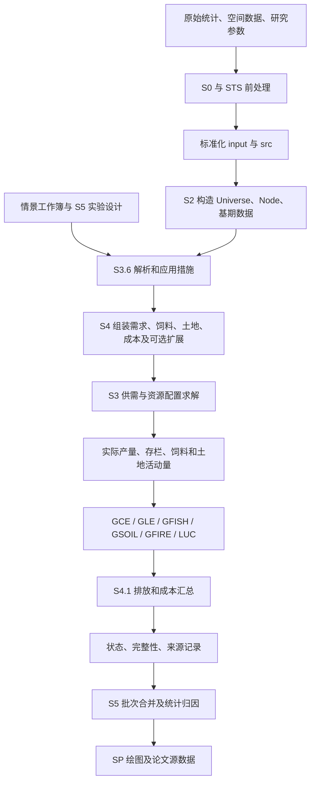
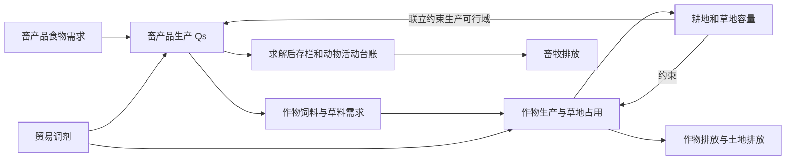
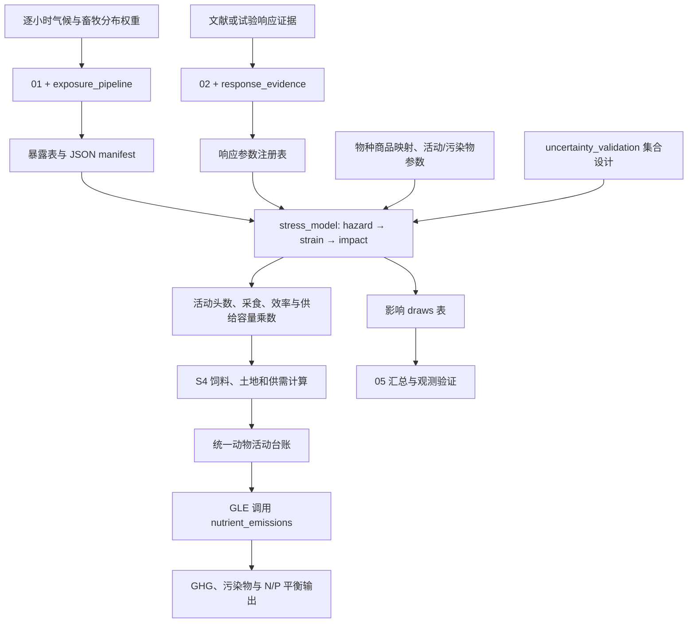

## 目录

1. [模型定位与阅读路线](#s01)
2. [目录、层次与总体流程](#s02)
3. [数据、索引和单位](#s03)
4. [主模型的核心思路](#s04)
5. [S4 主流程逐阶段说明](#s05)
6. [供需、贸易和营养约束](#s06)
7. [饲料—畜牧—作物反馈](#s07)
8. [土地、森林和 LUC 反馈](#s08)
9. [排放核算与汇总](#s09)
10. [情景变量如何进入模型](#s10)
11. [成本数据库与减排成本](#s11)
12. [生物能源链](#s12)
13. [热应激 STS 链](#s13)
14. [模块反馈关系总表](#s14)
15. [敏感性、蒙特卡洛与策略归因](#s15)
16. [模拟—合并—绘图的对应关系](#s16)
17. [输出、运行状态和缓存](#s17)
18. [配置与运行步骤](#s18)
19. [当前目录的依赖缺口及适用边界](#s19)
20. [维护方法与术语](#s20)

<a id="s01"></a>
## 1. 模型定位与阅读路线

模型把国家/区域、农产品、时间、排放过程和情景措施组织起来，计算满足食物及其他用途需求时的生产配置、饲料需求、土地占用与转换、温室气体排放和措施成本。它支持营养需求驱动和价格弹性驱动两类计算路径，也支持生物能源与牲畜冷热应激扩展。

模型可以用来比较饮食结构、损失浪费、单产、饲料效率、农业过程排放因子、森林目标、土地碳价及生物能源情景。S5 系列在同一主流程上重复运行设计好的情景，以估计敏感性、策略组合减排、国家主导措施和成本曲线。

理解结果时，应同时保留以下四个事实：

1. “Net-zero”是研究问题，不表示每次默认运行都带有总排放等于零的硬约束。达到某一排放目标的土地碳价搜索属于特定 S5.7 后续实验。
2. 默认需求方法为 `nutrition`。这一模式下，未来供给量由需求、资源、贸易与目标函数决定，未来节点跳过价格弹性供给方程。不能把其全部结果直接解释为通常意义上的价格均衡预测。
3. 物理减排、可计价减排、策略归因贡献、最终净排放是不同量，需分别查看。
4. 气候路径在本模型中作为外生输入；这里没有把本次计算的全球排放再送入气候模型、更新气候并重新求解的闭环。

建议阅读顺序：先读第 4、5、14 节掌握主线，再按研究问题读第 6—13 节；实际运行时读第 17—19 节；定位具体脚本时使用[逐文件说明](CODE_CATALOG_zh.md)。

<a id="s02"></a>
## 2. 目录、层次与总体流程

当前布局：

```text
Code/
├─ src/                    字典、情景工作簿、GCE/GLE/LUC 参数等
├─ input/                  生产、贸易、价格、人口、气候、土地等输入
├─ output/                 各次运行、敏感性实验、合并数据及图片
└─ bin/new_TS_clear/
   ├─ S0_*                 输入准备、校准及部分历史/情景结果整理
   ├─ S1_0_schema.py       数据结构
   ├─ S2_0_load_data.py    数据读取、映射和对象构造
   ├─ S3_*                求解器、饲料、情景、土地及生物能源模块
   ├─ S4_*                单次完整运行和结果汇总
   ├─ S5_*                重复实验、批次包装、合并及归因
   ├─ STS_*               热应激前处理、核心影响、排放和验证
   ├─ g*/luc*/lme*        分部门排放或历史兼容模块
   ├─ SP_*/SA*/SC*        绘图、分析、数据检查
   ├─ submit_sbatch_*     Slurm 作业提交
   └─ docs/model_guide/   本说明
```

`config_paths.py` 根据自身所在位置向上寻找 `Code`，支持 `NZF_CODE_ROOT`、`NZF_INPUT_DIR`、`NZF_SRC_DIR`、`NZF_OUTPUT_DIR`、`NZF_LUH2_DIR` 覆盖。Windows、macOS 和集群使用各自的真实绝对路径，项目本身由 OneDrive 同步。



这是一张概念流程图。S0 编号不是自动顺序执行列表：有的脚本独立准备某个参数，有的已属于历史校准或结果整理，不能把全部 S0 依次运行当成通用安装步骤。`S4_0_main.py` 是主要调度器；`S3_1_emissions_orchestrator_fao.py` 主要是历史接口和占位结构，不是当前完整物理排放计算的唯一入口。

<a id="s03"></a>
## 3. 数据、索引和单位

### 3.1 四个基础对象

| 对象 | 定义文件 | 内容及用途 |
|---|---|---|
| `Node` | `S1_0_schema.py` | 国家—商品—年份节点；存放基期供需 `Q0/D0`、价格 `P0`、弹性、温度/单产乘数、过程强度 `e0_by_proc` 与附加参数 |
| `Universe` | 同上 | 有效国家、商品、年份、过程及区域分类、商品分类映射 |
| `ScenarioConfig` | 同上 | 时间范围和部分基础参数；通常历史 2010—2020，未来默认 `[2080]` |
| `ScenarioData` | 同上 | 将节点、范围和配置打包交给求解与情景流程 |

运行中另有 `DataPaths`、`FeedDemandOutputs`、`BioenergyBundle`、`ThermalStressBundle` 等对象。它们把路径和中间表集中管理，而不是替代物理量的单位校验。

国家主键通常为带前导单引号、三位数字的 M49 字符串，例如中国为 `'156`；ISO3 和国家名称多用于映射和展示。`dict_v3.xlsx` 决定有效国家、商品、营养映射、排放过程以及区域分组。不同表中的 `Item_Production_Map`、`Item_Emis`、`Item_Nutrition_Map` 不能仅靠字符串相同视为同一分类。

### 3.2 主要输入

| 输入族 | 代表文件 | 进入的位置 |
|---|---|---|
| 字典及情景 | `src/dict_v3.xlsx`、`src/Scenario_config_new.xlsx` | S2 范围和映射；S3.6 措施与 MC |
| 生产、单产、需求 | `Production_Crops_Livestock_E_All_Data_NOFLAG_yield_refilled_baseYearFilled.csv`、`FoodBalanceSheets_E_All_Data_NOFLAG_demand_refilled.xlsx` | Q0、D0、单产、食物/饲料/其他用途拆分 |
| 人口与收入 | WPP 人口、`SSPDB_future_GDP_with_change_ratio.xlsx` | 营养需求总量或弹性需求驱动 |
| 价格与贸易 | `World_Production_Value_per_Unit.xlsx`、贸易表、`Armington_elasticity.xlsx`、可选价格楔子 | 基期价格、净贸易、贸易响应和上限 |
| 营养 | `Nutrition_profile_recalculated_fromD0_food_demand.xlsx`、`Intake_constraint.xlsx`、营养因子 | 食物需求、人均营养及最低摄入约束 |
| 饲料与存栏 | 每头饲料需求、草料比例、草地产量、`Environment_LivestockManure_with_ratio.csv` | 产量—头数—干物质—饲料作物—草地 |
| 土地 | `Land_cover_base_refill.xlsx`、LUH2 子集和掩膜、`LUCE_parameter.xlsx` | 土地容量、基期校准、转换及碳库核算 |
| 分过程排放 | GCE/GLE/Soil 参数、历史排放、水产面板、火灾排放 | 对应部门活动量和排放系数 |
| 成本 | `food_mitigation_cost_database_v2.0.json`，兼容 XLSX/MACC 输入 | 九类措施单位成本或 MACC 分段成本 |
| 生物能源 | `input/Bioenergy/` 下历史原料、情景目标、参数、资源限制表 | 可选原料市场、土地和能源平衡 |
| 热应激 | `input/ThermalStress/` 下气候暴露、参数、清单，以及物种映射 | 可选 STS 影响、活动台账、Tier 2 核算 |

具体路径定义见 [S2 路径配置](../../S2_0_load_data.py#L72)。这张表说明接口，不表示列出的全部文件已在本机完成存在性、内容及来源审计。

### 3.3 必须区分的计量口径

| 量 | 主要口径 | 容易混淆之处 |
|---|---|---|
| 商品数量 | t；个别林产品保留原始体积转换流程 | t 原料、t 干物质、m³ 不能直接相加 |
| 饲料 | kg DM/head、t DM、折算后的商品 t | 干物质需求转换成商品量需要含水率/转换系数 |
| 土地 | ha | 求解器内部可另设 `land_scale` |
| 能源 | TJ、GJ/tDM；源情景可能为 EJ | 1 TJ = 1000 GJ；初级能源与终端能源需按 energy_basis 区分 |
| 原始气体 | kg 或 kt 的 CO2/CH4/N2O | 应先识别质量单位，再按统一 GWP 转为 CO2e |
| 排放汇总 | 常用 kt CO2e；图表多用 Gt CO2e | kt→Gt 为 10^-6；t→Gt 为 10^-9 |
| 线性求解器过程强度 | 当前成本路径注释为 kt CO2e/t 商品 | 单位成本计价的减排量转为 t CO2e，因此有 1000 倍转换 |
| 单位减排成本 | USD/tCO2e | 不是 USD/t 商品，也不是目标函数全部惩罚项的单位 |
| 营养 | kcal/人/日、g/人/日、kcal/t 商品等 | 年总量需人口、365 天和质量单位转换 |

`S4_1_results.py` 的统一 GWP100 常量为 CO2=1、CH4=27.2、N2O=273。部分历史/辅助模块仍有不同的 GWP 常量或已经汇总的 CO2e 列，说明它们的存在不等于可跨路径混用；解释结果应以最终输出的来源、气体和单位字段为准。

<a id="s04"></a>
## 4. 主模型的核心思路

### 4.1 先确定活动量，再核算物理后果

模型的中心是“满足需求的生产与资源配置”。从食物需求和其他用途出发，联立决定哪些国家生产哪些商品、畜牧生产需要多少饲料和草地、可用土地是否允许、贸易如何调剂。求解后的产量、存栏和土地转换再进入具体排放过程。

优化器内部也使用排放强度、减排量和土地排放近似来构建成本及土地碳价目标；这些优化表达式与求解后的完整分过程核算相关，但不是同一层计算。最终排放以相应部门核算、覆盖处理和汇总结果为准。

### 4.2 默认 `nutrition` 模式的实际行为

`S3_0_ds_linear_regional.py` 中 `nutrition_supply_driven = (method == 'nutrition')`。未来节点进入该分支时，不添加常规价格弹性供给方程，而由平衡、土地、贸易上限、增长边界和目标函数共同选择 `Qs`。对应实现见 [未来供给分支](../../S3_0_ds_linear_regional.py#L7188) 和 [营养需求分支](../../S3_0_ds_linear_regional.py#L7449)。

因此当前默认模型更适合解释为：在给定营养结构和情景参数下，寻找满足需求及约束的生产、饲料、土地与贸易配置。`domestic_supply_simulation_mode='hard_equation'` 是配置项，但不能据此忽略 `nutrition` 分支的跳过行为。

在 `elasticity` 等路径中，才根据各路径规则应用自身价格和交叉价格响应。文件名中的 `linear_regional` 也不代表一定把国家合并成区域；默认 `use_regional_aggregation=False`，区域市场价格机制与生产节点的空间聚合是两个不同开关。

### 4.3 优化目标

概念表达为：

```text
最小化：供需缺口/过剩惩罚 + 贸易偏离或贸易量惩罚
      + 土地越界/森林目标松弛惩罚 + 土地转换代价
      + 启用的减排成本 + 启用的土地碳价项
      + 可选生产成本代理 + 数值选解的小权重项
```

默认关闭生产成本代理项（`disable_production_cost_term=True`）；BASE 的减排计价方法默认 `off`；一般情景配置为 `unit_cost`。土地碳价默认 0，因而“具有土地排放目标接口”不等于默认始终具有非零碳价激励。大惩罚系数的主要作用是约束执行与选解，不能把最终目标函数值直接称为全社会实际经济成本。

`objective_strategy='auto'` 时，求解器按未来年份数量选择：一个未来年份采用单阶段；多个未来年份采用先最小化可行性松弛、再在最优松弛容差内最小化成本的两阶段策略。详见 [目标策略选择](../../S3_0_ds_linear_regional.py#L11085)。

### 4.4 两种求解后端

| 后端 | 实现 | 解释 |
|---|---|---|
| 线性路径（默认） | `S3_0_ds_linear_regional.py` | 线性约束、营养/弹性模式、饲料、土地、贸易、单位成本、MACC 及缓存 MC 接口 |
| PWL 路径 | `S3_0_ds_emis_mc_full.py` | 以分段线性方法表示对数等关系的替代后端；不应理解成与默认路径完全同功能 |

PWL 后端明确不支持 `unit_cost`，该配置会报错；换后端必须同时核对成本、土地和扩展能力。不能仅把 `use_linear_model` 改为 `False` 就假定全部实验仍可按原含义运行。

<a id="s05"></a>
## 5. S4 主流程逐阶段说明

主要入口为 `main()` → `run_one_pipeline()` → `_run_one_pipeline_impl()`。外层包装负责异常状态和可重复运行记录；内部流程承担数据构造、求解、核算和输出。主要代码位于 [S4 主实现](../../S4_0_main.py#L10464)。

| 阶段 | 做什么 | 关键对象或结果 |
|---|---|---|
| 1. 解析运行方式 | 读取 CFG 或一个位置参数；选择 BASE、指定情景、情景集合或 MC | scenario_id、输出目录、run_id |
| 2. 建立运行记录 | 记录输入/配置来源和运行状态，按配置处理同名输出目录 | run_status、来源清单 |
| 3. 加载基期 | 字典、生产、需求、价格、弹性、人口收入、土地、营养和排放基期 | Universe、Node、基期缓存 |
| 4. 应用情景 | 解析选择器、单位和时间变化，构造乘数、目标及成本归属 | ScenarioEffect、scenario 参数字典 |
| 5. 热应激准备（可选） | 验证暴露和响应注册表，计算物种/商品影响、饲料及活动乘数 | ThermalStressBundle |
| 6. 建立需求及资源连接 | 食物、饲料、残余用途、种子、损失、生物能源，耕地和草地容量 | 求解器约束参数 |
| 7. 生物能源准备（可选） | 物理原料和能量转换、历史需求扣除、资源/土地、副产品及残余物接口 | BioenergyBundle |
| 8. 校准与求解 | 土地基期校准、历史锚定、贸易限制、供需与饲料/土地联立；按设置进行迭代 | Qs、Qd、价格、净贸易、土地状态和转换 |
| 9. 求解后检查 | 求解状态、残差、市场平衡、土地和生物能源目标可行性 | Diagnostics、有效性状态 |
| 10. 活动量重建 | 产量转存栏、每头采食、饲料/草地；STS 下构建统一台账 | 生产、存栏、饲料和活动表 |
| 11. 分部门排放 | GCE、GLE、GFISH、GSOIL、固定火灾、森林/土地簿记 | 分国家/商品/过程/气体的排放 |
| 12. 成本与汇总 | 基准对齐、物理和计价减排、加权成本；处理不同来源覆盖 | cost_summary、国家/全球措施汇总 |
| 13. 完成与验收 | 写结果、必需模块状态、来源/完整性声明，标记成功或失败 | 可被 S5 续跑与合并识别的结果 |

表中阶段是阅读组织，部分步骤在实现中交错或根据配置分支执行，不能理解为每项只调用一次。普通 S4 单次运行、S5 的整链重复运行和底层缓存 MC 也不是同一个入口。

<a id="s06"></a>
## 6. 供需、贸易和营养约束

### 6.1 总需求与市场平衡

为便于解释，以 c、j、t 表示国家、商品、年份，可将营养路径的需求结构写为：

```text
Qd[c,j,t] = 食物需求 + 饲料需求 + 非食物残余用途 − 生物能源副产品饲料抵扣
Qs[c,j,t] + 净进口[c,j,t] = Qd[c,j,t] + 显式生物能源作物需求[c,j,t]
```

这是主要含义，历史固定节点、特殊商品和其他需求模式存在分支。生物能源市场需求作为独立用途进入平衡，不能一边放在 `Qd` 内，一边又在右端再加一次。

净进口为正表示进口，负表示出口；各市场/商品年度还存在净进口汇总与短缺、过剩之间的出清约束。不能用“Qs 小于 Qd”单独判定国家不可行：贸易可能补足；反之，求解器给出解也不表示短缺或软约束超额一定为零。

### 6.2 四种需求方法

| 方法 | 食物数量的决定方式 | 解读重点 |
|---|---|---|
| `nutrition`（默认） | 由营养结构、人口及情景确定，加入饲料和残余用途 | 价格不自动决定最终饮食；未来 Qs 走需求驱动配置分支 |
| `nutrition_band` | 营养需求附近上下界，默认 CFG epsilon=0.05 | 检查上下界和其余方程是否同时成立 |
| `nutrition_anchor` | 以营养需求为锚，结合价格响应 | 人口已计入营养锚后不能再次重复乘入 |
| `elasticity` | 由自身/交叉价格、人口、收入等响应决定 | 需要解释弹性、价格界限及基期校准 |

营养路径中，人均 kcal 或 g 与人口、年份和商品营养系数转换为物理食物量。最低营养约束与商品结构不是同一件事；反刍动物份额上限、替代食物和补足方式由营养情景及 `ruminate_supplement` 控制。

弹性模式的结构可简写为 `Qs = a_s + b_s P + Σ b_cross P_other`，需求也有自身和交叉价格项，并通过外生人口、收入调整基期。真实系数还处理温度、单产、价格楔子、数量缩放和零价格停产重写。这里的式子用于理解，不替代源码全部边界条件。

### 6.3 贸易与区域价格

默认 `market_clearing_mode='regional_armington'`，同时 `use_regional_aggregation=False`。含义是保留国家生产节点，使用相应区域市场价格/贸易机制，不等于先把全部生产量聚合成少量区域。

贸易容量可以按国家、区域、全球或混合尺度限制。动态上限参考基期贸易、自给率、进口依赖、国家—商品规模等指标。缺少本国产量但有营养需求的组合可以补充需求节点。检查贸易时应同时看基期量、cap 分组、正负净贸易和 slack。

<a id="s07"></a>
## 7. 饲料—畜牧—作物反馈

`S3_2_feed_demand.py` 将牲畜存栏转换为每种动物的干物质需求，拆为草料和作物饲料，再用干物质转换系数映射到具体作物吨数。输出对象包括 `crop_feed_demand`、`grass_requirement`、`species_dm_detail`、`crop_feed_by_species`。

概念关系：

```text
动物头数 ≈ 畜产品产量 / 每头产出（结合生产头数比例、屠宰和周转规则）
总干物质需求 = 动物头数 × 每头采食量
作物饲料 = 总干物质 × 作物饲料比例 × 商品分配与干物质转换
草地需求 = 草料干物质 / 单位草地产草量
```

默认 `feed_crop_link_mode='dynamic_constraints'`：S4 把“每单位畜产品需要各作物饲料多少吨”的系数写入求解器。畜产品产量变化会在同一次求解中改变饲料作物需求及其土地压力。这是数学约束的联立反馈，不需要把每个模块在 Python 中反复调用才成立。



其他方式：`iterative` 在外层更新饲料量并重复求解，使用最大迭代次数和相对收敛阈值；`off` 关闭这条动态连接，不具备相同的反馈含义。草地另有 `dynamic/static` 控制，不能与饲料连接开关混为一谈。

STS 启用时可使用物种—畜产品—饲料矩阵，并将活动头数、每头采食及饲料效率乘数分开传播；按实现的物理关系，每单位产品饲料需求由“每单位产品头数 × 每头采食需求”组合，避免重复施加同一乘数。

<a id="s08"></a>
## 8. 土地、森林和 LUC 反馈

### 8.1 土地需求与供给容量

作物土地需求基本由产量/单产得到，草地需求由草料干物质/草地产量得到；实际进入求解器时还考虑基期土地容量校准、不同作物/畜种映射和可选能源作物占地。

默认 `land_demand_calibration_mode='base_stock_capacity'`、基期土地来源 `LUH2`。这样将产量推算需求与基期实际土地存量对齐，避免基期的不同统计口径在未来被误认为新增土地转换。模型可联立选择耕地、草地和森林之间的转换；森林目标、恢复上限和转换循环限制会改变可行域。

### 8.2 三种土地耦合方式

| `luc_coupling_mode` | 土地核算来源 | 对求解的关系 |
|---|---|---|
| `Qs_demand` | 求解后的 Qs/活动量推算土地变化 | 更偏向后处理核算 |
| `solver_luc` | 求解器实际土地状态与转换流 | 土地容量和转换已经约束生产；不启用该模式的 LUC 排放优化项 |
| `optimize_luc`（默认） | 同样使用求解器土地状态 | 增加线性化土地排放/碳价接口，影响选解的程度取决于非零系数及配置 |

当前 CFG 的 `luc_opt_mode='none'` 会在 `optimize_luc` 路径中被提升为 `explicit`，不能直接按字面判断土地优化未连接。详见 [S4 模式解析](../../S4_0_main.py#L15362)。`iterative` 则是另一种带外层更新的土地优化方式。

### 8.3 终点土地与年度碳排放

默认只求解 2080 年未来终点，并不表示把 2020—2080 所有土地转换都排放在 2080 当年。`luc_accounting_path_mode='linear_to_target'` 会构造内部年度路径，`luc_emission_module.py` 按转换、森林生物量、土壤和木制品等碳库进行簿记。最终保留请求的输出年份。

应区别：终点面积存量、年度新增转换面积、碳库遗留效应、某年排放流量以及跨年累计排放。这五种量不能互相替代。

### 8.4 森林背景与恢复边界

默认启用历史背景土地转换投影，使用近期历史参考、指数衰减、`accounting_only` 终点状态和 `annual_projection` 排放核算。该背景用于继承尚未消失的历史压力，不是让同一项既作为终点新增需地又重复累计为未来转换。

森林恢复默认受已释放农业用地、物理上限和转换循环限制；现有森林汇与新增恢复碳库分别处理。土地碳价会影响转换选择，但 `S3_5_land_use_change.py` 中价格诱导“集约化代理”的默认系数为零，不能据此宣称提高碳价会自动提高物理单产。

<a id="s09"></a>
## 9. 排放核算与汇总

### 9.1 当前主链中的部门

| 部门/文件 | 活动驱动及核算 |
|---|---|
| GCE：`gce_emissions_complete.py` | 作物产量、收获面积、残余物氮/干物质、稻作、合成氮肥及过程因子 |
| GLE：`gle_emissions_complete.py` | 畜产品→存栏/生产头数→肠道发酵、粪便管理、施土和放牧过程；STS 下接收统一活动台账 |
| GFISH：`gfish_emission_module_complete.py` | 捕捞/养殖结构、养殖面积/产量及 CH4/N2O 参数；历史读面板、未来计算 |
| GSOIL：`gsoil_emission_complete.py` | 耕地/草地中的排水有机土壤面积与 CO2/N2O 参数 |
| GFIRE：`gfire_emission_fixed_module.py` | 从历史火灾数据构造固定参考排放；不由农业求解器重新预测火灾气象发生过程 |
| LUC：`luc_emission_module.py` | 土地转换、木材采伐、轮耕及碳库动态 |
| 历史 LUC：`luc_historical_module.py` | 读取历史土地排放/汇并整理为可对接格式 |

`*_fao_legacy.py` 和 `lme_manure_module_fao.py` 包含历史或独立核算实现。存在这些文件不等于主模型将它们与完整模块全部相加；应按真实调用关系选用。旧注释中的 GFE/GOS 等缩写也存在历史含义变化，文档以文件内的实际过程为准。

### 9.2 历史与未来

历史观测通常作为基准与锚点，未来由情景下的活动量及参数计算。不同模块具有各自的历史读取规则，特别是 GLE/GFISH/GSOIL 和 LUC。不能把历史观测和未来活动量乘系数当成同一生成方法。

### 9.3 优化排放与正式汇总

优化器中的 `e0 × Qs` 可用于排放近似、减排约束和成本归属。正式核算还包含产量→头数、收获面积、肥料、土地碳库等细节。S4 将模型来源与 FAO 部门来源整理为排放明细，并根据覆盖键消除重复来源后统一汇总；不能直接把求解器 `Eij` 和所有部门总量无条件相加。

`S4_1_results.py` 输出国家、区域、商品、过程、气体等尺度。正排放、森林碳汇、土地恢复负排放、生物能源化石替代/BECCS 需要按输出过程和作用域分别确认。净排放总量不等于全部措施可计价的正减排量。

<a id="s10"></a>
## 10. 情景变量如何进入模型

`S3_6_scenarios.py` 读取 `Scenario_config_new.xlsx`，将每行措施转换为 `ScenarioEffect`，按国家/区域、商品类别、过程及气体选择器匹配到有效节点。重要参数语义为：

| 表中表达 | 含义 |
|---|---|
| `rate` | 相对基准变化率；例如 -0.2 通常转成 0.8 倍，具体变量按自身定义处理 |
| `multiplier` | 直接乘数；0.8 就是 0.8 倍，不能再加 1 |
| `amount/absolute` | 数量、金额或变量定义下的绝对值，不能统一解释为比例 |
| `Y2020_*` | 基期引用形式，由 MC 边界解析器处理；不是普通浮点字符串 |

部分策略类别的变化率、占比上限、绝对阈值和成本键不同。例如反刍动物份额上限不是把所有牲畜产量统一乘一个数；粪便管理改变处理结构；损失变量调整损失/残余用途；单产既会影响土地需求，也可能影响供给参数。

措施传播的主要路径：

| 情景变化 | 首先改变 | 后续传导 |
|---|---|---|
| 饮食/反刍份额 | 营养食物结构、替代补足 | 畜牧产量→饲料和草地→贸易/土地→排放 |
| 损失浪费 | 需求中的损失部分 | 总生产需求与土地占用 |
| 作物/畜牧单产 | 单位土地/每头产出等相应参数 | 活动量和土地容量；具体分支决定价格响应 |
| 饲料效率 | 单位产品或每头饲料需求 | 饲料作物、草地及间接排放 |
| 过程 EF | 选中的国家—商品—过程—气体参数 | 对应排放及可识别的过程成本 |
| 肥料/粪便/残余物管理 | 投入或物质流结构 | 物理活动量与过程因子共同变化 |
| 森林目标/土地碳价 | 森林目标或土地转换激励 | 土地可行域、生产分配、碳库路径 |
| 生物能源/热应激 | 专用扩展输入与开关 | 按第 12、13 节传导 |

多措施情景不保证减排线性可加。一个参数同时影响产量、饲料、土地和不同排放过程时，会与其他参数形成交互，这正是 S5.7 使用组合重跑与 Shapley 分解的原因。

<a id="s11"></a>
## 11. 成本数据库与减排成本

### 11.1 当前 JSON 的实际结构

用户当前打开的文件为 `Code/input/Price_Cost/Cost/food_mitigation_cost_database_v2.0.json`。本次只读核对得到：

| 字段 | 值 |
|---|---|
| 顶层结构 | `metadata` + `solver_export` |
| 版本 | `v2.0-2026-09-04` |
| Schema | `food_mitigation_cost_database.v2` |
| 目标年份 | 2080 |
| 覆盖 | 190 个国家 × 9 类策略 = 1710 条记录 |
| 单位 | USD/tCO2e |
| 负成本处理 | `Final_Unit_Cost = max(0, Preferred_Cost)` |
| 文件 SHA-256 | `7ad8e7545cfeeb43ed5255c3410dab6ef116190077c44e6a3350eb536f7b0102` |

JSON 中还保存 `Cost_Low/High`、来源、估算层级、填补标记、证据质量和 `Cost_Concept`。这些字段的存在不意味着主模型自动对区间抽样；当前单位成本查表使用经过校验的最终成本。部分记录的成本概念为政策碳价信号而非直接转型资源成本，跨措施比较必须保留该区别。

### 11.2 九类策略与两层计价

| 层次 | 数据库 `strategy_kind` | 模型键 | 物理作用 |
|---|---|---|---|
| 系统策略 | ruminant_reduction | RuminantReduction | 饮食/反刍份额 |
| 系统策略 | losses_ratio | LossWaste | 损失浪费 |
| 系统策略 | yield_rate | YieldRate | 单产 |
| 系统策略 | feed_intensity | FeedEfficiency | 饲料效率 |
| 过程措施 | enteric_fermentation_management | EntericF | 肠道发酵 |
| 过程措施 | manure_management | Manure | 粪便相关过程 |
| 过程措施 | crop_residue_soil_management | Residue | 作物残余物和土壤相关过程 |
| 过程措施 | rice_management | Rice | 稻作 |
| 过程措施 | fertilizer_efficiency | Fertilizer | 肥料效率/合成氮肥过程 |

S5 策略注册表中的名称与数据库名称可能不同，例如稻作策略名称存在 `rice_cultivation` 与 `rice_management` 的映射，不能用一列字符串替代所有层次的键。

连接关系：S2 的 `DataPaths` 提供 JSON 和字典路径；S4 调用 `cost_database_v2.load_cost_database_v2()` 校验并取得 `(M49, model_process_key)` 单位成本，同时读取字典中的过程成本映射，再结合活动措施、参考 BASE 和物理作用域送入线性求解器。求解后的 `S4_1_results.generate_cost_summary()` 与 `S5_cost_summary_outputs.py` 分别完成单次和实验级汇总。当前 JSON 加载入口见 [S4 成本加载](../../S4_0_main.py#L14504)；S2 中另存有旧 XLSX 单位成本读取接口。

### 11.3 成本和减排的关系

```text
计价减排量 A = 在规定过程范围内、相对匹配参考情景的可计价正减排（tCO2e）
措施成本 C = 单位成本 u（USD/tCO2e）× A
合并单位成本 = ΣC / ΣA
```

A 的范围不一定包括所有土地碳汇、负排放或全球净减排。应同时查看物理减排、计价减排和未计价量。零成本是一条有效记录；缺失成本不是零成本。数据库按规则把负 Preferred_Cost 截为零，这与保留原始负成本曲线的含义不同。

在显式归属方式下，一次求解最多指定一个措施成本所有者；多个重叠措施不能对同一减排吨数重复收费。空列表可关闭组合情景的显式成本归属；`None` 保留过程计价兼容行为。组合减排的归因与成本曲线由 S5 后续流程处理，而不是把各措施独立减排简单相加。

BASE 不仅提供产量，还提供匹配的排放过程账本。当前严格单位成本接口会拒绝仅凭 Qs 的参考或错误物理范围。国家/全球措施结果汇总采用减排加权成本。

需要另行区分的是输入端的区域聚合：非默认 `use_regional_aggregation=True` 时，S4 以区域内国家单位成本的简单平均构造区域成本参数；默认国家节点模式保留原国家记录。这个输入简化与结果端的 `ΣC/ΣA` 不是同一算法，区域聚合与国家模式的成本结果不能直接当作等价。

### 11.4 其他成本路径

`MACC` 使用分段边际减排成本曲线；`unit_cost` 使用固定的国家—措施单位成本；`off` 不执行相应减排成本优化。土地碳价是额外配置，S5.7.3 在组合措施基础上搜索达到目标所需的土地碳价，不能把它自动视作九措施 JSON 中的第十个普通过程成本。

S5.9 还校验数据库版本和文件哈希，因此即使 JSON 路径相同，内容改动后也可能触发来源一致性拒绝。对应检查不是文件名检查。

<a id="s12"></a>
## 12. 生物能源链

### 12.1 前处理

```text
FAOSTAT 能源历史 → S0_50 → 国家—能源载体历史/份额
载体—原料份额 + 历史 → S0_51 → 历史物理原料需求
空间可用土地 → S0_54 ┐
非作物资源清单 → S0_55 ├→ S0_52 → 资源/产量/土地上限
残余物资源和基期土地 ┘
AR6/SCI 能源目标 + 历史份额 + 资源参数 → S0_53 → 低/中/高情景原料需求
```

这组脚本的数字顺序不表示执行依赖顺序，例如 S0_54/S0_55 的输出可以作为 S0_52 输入。S0_53 默认使用 AR6 C1–C2 子集的 P10/P50/P90 轨迹构造低中高情景；这是代码中的情景构造规则，不是本说明重新验证的外部数据库结论。

### 12.2 进入主模型的接口

`S3_3_bioenergy.py` 建立 `BioenergyBundle`，将能量目标转换为物理原料需求。基本换算为：

```text
tDM = TJ × 1000 / (LHV_GJ_per_tDM × conversion_efficiency)
原料吨数 = tDM / dry_matter_fraction
```

主要连接及边界如下：

| 接口 | 反馈 |
|---|---|
| 历史作物原料需求 | 从 FBS 已包含的基期残余需求中扣除，避免历史用途重复计入 |
| `market_link=true` 的作物原料 | 作为独立生物能源用途进入商品市场平衡 |
| 专用能源作物 | 通过土地需求/可用土地接口占用资源；不必作为普通食用商品进入市场 |
| 副产品饲料 | 抵扣对应饲料商品需求；默认以干物质吨近似商品吨当量，并有基期饲料抵扣上限 |
| 残余物移除 | 传递至作物残余物管理/排放相关接口 |
| 残余物与饲料竞争 | 当前默认 `diagnostic_only`，不能宣称所有竞争已变为硬性求解约束 |
| 能源、资源和土地缺口 | 生成前置与求解后可行性检查；求解器成功不代表能源目标满足 |
| 替代化石排放及 BECCS | 单独报告相应核算量；解释净值时核对是否及如何进入使用的最终表 |

能源需求可能增加作物生产和土地压力，也可能产生副产品饲料抵扣或替代排放。总效果取决于原料结构、资源约束、贸易和土地转换，不能预设为净减排。非作物资源有相当部分通过资源表与核算接口处理，并非全部在求解器内部联合优化成完整能源系统。

`bioenergy_enabled=False` 为当前默认。S5.9 将低中高生物能源配置与九措施归因联结；其 `preflight` 不求解，但会重建/审核派生输入并写输出，不是纯只读检查。

<a id="s13"></a>
## 13. 热应激 STS 链

八个文件的职责：

| 文件 | 作用 |
|---|---|
| `STS_S0_01_prepare_thermal_exposure.py` | 暴露前处理命令行入口 |
| `STS_thermal_exposure_pipeline.py` | 从对齐逐小时气候与畜牧权重计算 5 km 暴露指标及 JSON manifest |
| `STS_S0_02_prepare_thermal_response_registry.py` | 证据→响应参数命令行入口 |
| `STS_thermal_response_evidence.py` | 响应拟合、证据质量处理和留出研究验证 |
| `STS_thermal_stress_model.py` | 暴露→strain→impact→活动乘数/商品映射，并提供统一活动台账构建 |
| `STS_thermal_nutrient_emissions.py` | Tier 2 能量、干物质、氮磷平衡和气体/污染物清单 |
| `STS_thermal_uncertainty_validation.py` | 气候/参数等集合设计、影响样本、分位数和外部观测验证 |
| `STS_S0_05_validate_and_summarize.py` | 读取已有 draws，汇总并可选比较观测 |



核心生理传导涉及乳/蛋产出、肉畜生产周期、死亡/更新、采食、维持能量和消化率等。实际因子与生理效应取自注册表，并通过活动量与饲料连接传递；不能将所有作用直接等同于一次统一的牲畜产量缩放。

主流程用求解后的产量及存栏重建活动台账，再由 GLE 接收该台账。Tier 2 路径计算 GE/Ym、VS/B0/MCF、氮磷摄入与留存、粪便管理分配及排放，并检查质量平衡。当前实现避免在 GLE 计算完后再次把整张排放表乘上热应激系数。

STS 当前默认关闭；开启时严格检查气候成员、情景、年份、空间元数据、响应覆盖、来源和生产参数。模板中的占位参数不是正式研究参数。模板 README 中的 CSV 数据登记表和运行器要求的 JSON exposure manifest 是两种不同文件，不能互换。

普通 `run_thermal_bundle_ensemble()` 多次构建热应激影响 bundle，输出商品影响样本；它本身不自动完成每个样本的全球供需求解与 Tier 2 排放。完整热应激 MC 由 S4 的 `_run_thermal_mc()` 逐样本调用完整 S4 流程。`STS_S0_05` 则仅对已有、字段匹配的 draws 做汇总，S4 输出可能需要先整理成其要求的 `m49/year/commodity/metric` 表。

<a id="s14"></a>
## 14. 模块反馈关系总表

“反馈”有三种实现：求解器内部同时满足的一组约束、Python 外层迭代、求解后向下游单向传递的核算。以下表格区分它们。

| 起点 → 终点 | 传递量 | 实现方式 | 是否再约束上游 |
|---|---|---|---|
| 食物结构 → 畜牧/作物需求 | 商品食物吨数、营养下限 | 求解前构造需求 | 约束产量配置；默认不由价格自动重写饮食 |
| 畜牧产量 → 饲料作物 | 单位畜产品饲料系数 | 默认动态线性约束 | 是，作物容量反过来限制可行的畜牧生产/贸易 |
| 畜牧产量 → 草地 | 草料需求和草地产量 | 默认动态草地约束 | 是 |
| 作物生产 → 耕地 | Qs/单产，经基期容量校准 | 求解器土地约束 | 是 |
| 耕地/草地 → 森林 | 土地存量和转换流 | 联立土地状态与恢复约束 | 是 |
| 土地碳价 → 土地转换/生产 | 转换排放近似与价格 | 配置启用的目标函数项 | 是；零碳价时没有同等激励 |
| 贸易 → 生产与供需 | 净进口、区域价格、贸易上限 | 市场联立 | 是 |
| 动态饲料/土地 → 再求解 | 更新的需求或线性化系数 | 仅 `iterative` 等路径 | 是，按阈值判断收敛 |
| 生物能源 → 农业 | 原料需求、能源作物地、副产品抵扣 | 市场/土地约束与派生接口 | 部分是；部分为诊断/核算 |
| STS → 畜牧/饲料 | 活动、采食、效率等乘数 | 求解前与求解后共享参数/台账 | 对资源可行域有反馈；暴露本身仍外生 |
| 生产/存栏 → 部门排放 | 活动量、投入、面积、过程因子 | 求解后物理核算 | 默认不会把完整核算结果自动全部送回重求解 |
| 排放 → 单位成本 | 匹配 BASE 的物理/计价减排 | 求解器接口及结果归集 | 特定成本目标影响求解；汇总表本身不反馈 |
| 单次运行 → S5 下次运行 | 策略集合、抽样或搜索设置 | 外层实验设计 | 仅设计好的实验/搜索路径 |
| 本模型排放 → 全球温度 → 本模型 | 无完整连接 | 未实现气候模型回算闭环 | 否 |

例如“提高饲料效率”先降低单位畜产品饲料需要，再释放作物生产和草地压力，可能减少土地扩张及其排放；但贸易重分配、森林目标与生物能源用途都可能改变释放土地的去向，因此最后应比较完整场景结果。

<a id="s15"></a>
## 15. 敏感性、蒙特卡洛与策略归因

| 系列 | 回答的问题 | 数据与方法 |
|---|---|---|
| S5.0 | 哪些措施解释排放水平/目标附近的变化？ | 多变量抽样、整链运行、重要性统计；当前默认 2000 样本 |
| S5.1 | 指定变量不同水平的排放分布如何变化？ | 水平扫描 + 其他变量抽样；包含共享 MC 参数工具 |
| S5.3 | 单产、EF 与森林/反刍份额组合的可行域和排放如何变化？ | 面板网格、批次、完整性合并与绘图数据整理 |
| S5.3 v2 | 组合 E/L 轴和代码命名的 L/A 轴如何影响结果？ | 横轴 EF、肥料、作物土壤参数同向，粪便管理反向；纵轴单产同向、饲料强度反向；不能与原版坐标直接混用 |
| S5.4 | 全变量不确定性下总排放和实现后的指标分布？ | 默认 20000 样本；fast summary、过程排放、加权参数、实际饮食/土地指标 |
| S5.5 | 国家/区域、商品、排放过程结构的重要性？ | 复用完整变量 MC，但保留细分排放，汇总结构长表 |
| S5.6 | 给定测试端点下全球或单国可达到多少减排？ | 多措施、单措施、国家行动者情景；不等于对所有政策空间证明全局最大 |
| S5.6.4 | 强端点不可行时怎样退回可行组合？ | 沿预设顺序逐步放松措施的贪心搜索；首个可行点不是全局最优证明 |
| S5.7 | 九类措施的组合减排如何归因、如何形成 MACC？ | 全模型单措施与组合重跑，策略映射来自单独 JSON，支持 exact Shapley |
| S5.7.3 | 实施一定措施后，达到排放目标还需要多少土地碳价？ | 读取实施比例，先扫描价格区间再按设置细化 |
| S5.8 | 每个国家哪项单独干预的减排潜力最大/单位成本最低？ | 单国×单措施，同批独立参考；本国效果和全球效果不能混用 |
| S5.9 | 低中高生物能源情景下措施 MACC 有何不同？ | 复用 S5.7、输入审核、成本来源检查与绘图 |

S5.7 的 Shapley 原理：对措施 i，计算其加入不同已有措施集合时的边际减排，再按组合权重平均。九措施完整集合为 `2^9=512` 个组合（含空集 BASE）。这是独特组合数，批次独立 BASE、详细单措施重跑和后续 CDR 扫描可能增加实际求解次数。

S5.9 `quick` 每个生物能源面板运行 BASE、完整包及九个单措施，共 11 个情景，以正单措施比例缩放近似组合贡献；`exact` 使用完整组合。quick 结果不能称为 exact Shapley。`preflight` 只验证接口、重建派生表和准备设计，不证明全球优化可行。

统计重要性、排放结构占比、Shapley 减排贡献和政策单位成本分别回答不同问题。尤其 `SP_M4f_*_v2` 的结构份额与 `_v3` 的回归重要性不能只因都画堆叠图就当成同一指标。

<a id="s16"></a>
## 16. 模拟—合并—绘图的对应关系

每条实验链一般采用“运行器 → batches 包装 → merge → 整理/绘图”。batches 负责分配样本或场景，Shell 负责生成并提交 Slurm 作业，它们不代表另一套物理模型。

| 研究图/任务 | 生成和合并 | 主要绘图入口 |
|---|---|---|
| 历史排放结构 | S0.48 / S4 明细 → `SP_M1a_*_pre` | `SP_M1a_*_plot` 各版 |
| AR6/SCI 情景比较 | 对应 prep + S0.44/46/47 | `SP_M1b_*` |
| 面板等值线（主图 Figure 2） | S5.3.1 → S5.3.3 → S5.3.2 | `SP_M2_Figure_contour.py` |
| 低中高生物能源 MACC（Figure 3a–c） | S5.9 + S5.7 合并 | `SP_M3a_Figure_macc_stock_v3.1.py` |
| 国家主导措施（Figure 3d） | S5.8.1 → S5.8.2 → S5.8.3 | `SP_M3d_Figure_country_dominant_mitigation_intervention.py` |
| 策略与结构重要性（Figure 4a–d） | S5.0 + S5.5 完整结构数据 | `SP_M4f_Figure_structure_importance_targetrange_v3.py` |
| 四分位分布（Figure 4e–h） | S5.4.1 → S5.4.2 | `SP_M4b_Figure_yield_ef_effect_line_targetrange_v2.py` |
| 生产趋势、反刍占比、减排瀑布图、单位热量排放 | S4 / S0.49 / 对应历史数据 | `SP_SI1`—`SP_SI4` |

上表稿件编号沿用项目近期工作流记录；脚本和输出仍可能保留历史 `Figure1/2/4/5/9` 名称。定位某张图时应核对输入文件和计算公式，不应只按文件夹编号判断。

当前 Figure 3d 使用标准化排名表并记录并列/近似并列、国家几何匹配和缺失。旧 `SP_M3b` 系列保留作兼容图，不应自动替代该定义。

S5.4 的快速输出适合全局分布，但不足以重建完整国家—商品—过程结构，因此 S5.5 会强制保存细分排放。合并 S5.3 时只汇总批次表，不复制每个运行目录；批次完整性、唯一情景 ID 和失败状态仍是必要检查。

<a id="s17"></a>
## 17. 输出、运行状态和缓存

### 17.1 单次场景的主要输出

| 文件/目录 | 用途 |
|---|---|
| `run_status.json` | 运行是否完成、求解与核算有效性、来源和产物状态；具体写入依赖辅助模块 |
| `emission_module_manifest.csv` | 必需排放模块是否运行及其结果完整性 |
| `DS/` | 供需、生产、国家年度、营养及土地相关结果 |
| `Emis/` | 分气体/过程/商品排放明细及汇总 |
| `Diagnostics/` | 市场平衡、作物—牧场平衡及其他残差/覆盖检查 |
| `cost_summary.csv` | 物理减排、计价量、单位成本、总成本及归属 |
| `cost_summary_by_country_measure.csv` | 国家×措施成本汇总 |
| `cost_summary_by_global_measure.csv` | 全球×措施成本汇总 |
| `ThermalStress/` | 启用 STS 时的暴露、影响、活动台账、污染物及质量平衡 |
| `bioenergy_*.csv` | 启用生物能源时的原料、土地、能源、资源和可行性结果 |
| 日志与来源清单 | 追溯配置、输入、模块执行和错误 |

最终存放位置以调用时的 `save_root`、`NZF_OUTPUT_DIR` 及输出代码为准，不保证所有表都位于同一个子目录。

### 17.2 快速排放与详细输出

`fast_emis_only=True` 在完成相应核算后减少市场、生产和详细排放导出，保留快速排放、必要诊断及相关成本表。它不是“只运行一个简单排放乘法”的同义词。下游需要商品/国家细分时，应选择详细输出路径，而不是把快速表伪装成完整明细。

### 17.3 什么算成功

成功判断至少需要兼顾：求解状态和可提取解、约束/市场诊断、必要模块完整性、关键产物和来源一致性。仅有某个 CSV、某行日志或 Gurobi 的结束信息不足以证明整次情景有效。S5 的续跑和合并通过结构化状态减少把旧目录、残缺产物或失败样本当作成功的风险。

当前 `clean_output_dir=True`：新的一次同名情景调用可能清理原场景目录，防止旧文件被误认成新结果。实际运行示例应使用明确独立的输出根，避免覆盖已有生产结果。

### 17.4 缓存与不同 MC 入口

`runtime_data_cache.py` 缓存表读取，S4 还维护基期蓝图/数据缓存。缓存依赖文件签名和配置；修改源表后需要核对缓存刷新策略。`refresh_runtime_caches_on_start` 当前为 False。

底层 `LinearModelCache`/`ModelCache` 通过修改既有模型系数复用模型；S5 多数实验调用完整 `run_one_pipeline()`。两者的覆盖范围、结果细度和扩展能力不同。热应激 MC 已有独立完整流水线入口，逐样本建立隔离配置和运行目录，不能用普通缓存 MC 代替。

<a id="s18"></a>
## 18. 配置与运行步骤

### 18.1 当前主要默认值

| 配置 | 当前值 | 实际意义 |
|---|---|---|
| `run_mode` | `' scenario-S30'`，执行时 strip | 不传参数会按 S30 情景入口运行 |
| `base_case` | BASE_nutrition5 | 普通单位成本情景参考 |
| `use_linear_model` | True | 默认线性后端 |
| `demand_method` | nutrition | 需求/资源配置路径 |
| `future_last_only` | True | 通常仅未来终点；STS 有显式时间轴 |
| `use_regional_aggregation` | False | 保留国家生产节点 |
| `market_clearing_mode` | regional_armington | 区域价格/贸易机制 |
| `feed_crop_link_mode` | dynamic_constraints | 饲料联立反馈 |
| `grassland_method` | dynamic | 草地动态变量 |
| `base_land_cover_source` | LUH2 | 基期土地来源 |
| `luc_coupling_mode` | optimize_luc | 使用求解器土地状态及可用的优化接口 |
| `luc_opt_mode` | none → 主流程提升为 explicit | 需结合高层模式判断 |
| `land_carbon_price` | 0 | 默认无非零土地碳价 |
| `cost_calculation_method` | unit_cost | 一般情景单位成本 |
| `base_cost_calculation_method` | off | BASE 关闭相对基准减排计价 |
| `disable_production_cost_term` | True | 关闭可选生产成本代理 |
| `bioenergy_enabled` | False | 生物能源需显式开启 |
| `thermal_stress_enabled` | False | STS 需显式开启 |
| `temperature_driver_enabled/strict` | True / True | 普通温度驱动与 STS 开关独立 |
| `clean_output_dir` | True | 同名场景重跑可能替换原结果 |
| `land_soft_constraints_enabled` | True | 允许按上限和惩罚设置的小幅土地超额，默认比例 0.05 |
| `max_slack_rate` | 0.1 | 市场 slack 的配置上限；需查看实际使用分支和结果 |

默认值来自源码快照，S5 会覆盖其中若干项。因此复现实验必须记录实际运行配置，不能仅引用这张静态表。

### 18.2 推荐的操作顺序

1. 明确当前源码目录及输入、配置、输出根；先处理第 19 节的缺失依赖。
2. 对拟使用的配置准备对应数据。已有派生输入时，不需要重跑所有 S0。
3. 用一个独立输出目录建立 BASE，检查供需/土地诊断、模块完整性和成本基准所需明细。
4. 在相同输入版本、时间和模型配置下运行目标情景，明确参考 BASE。
5. 单次链路有效后，再开展 S5 批次实验。
6. 合并时检查期望批次、情景 ID、失败记录和参考一致性，再整理图表输入。
7. 保存运行清单、图表源数据和使用的版本/参数，避免只留下最终 PNG。

### 18.3 运行示例

以下仅为接口示例，本次未执行；需先补齐依赖、输入和可用求解环境。在 PowerShell 的 `new_TS_clear` 目录下：

```powershell
# 建议使用此次实验专属的新输出目录；按实际实验名修改。
$env:NZF_OUTPUT_DIR = Join-Path (Resolve-Path '../..').Path 'output/Example_Model_Run_20260919'
python S4_0_main.py BASE_nutrition5
python S4_0_main.py scenario-S30
```

S4 目前支持一个运行模式位置参数，不是可以任意传入 CFG 键的通用命令行。`--help` 的分派不会启动求解，但顶层导入仍要求辅助模块和 Python 依赖可用。更复杂的参数通过现有 CFG 或 S5 的运行配置/API 设置。

STS 前处理示例：

```text
python STS_S0_01_prepare_thermal_exposure.py --climate <hourly.csv> --livestock-weights <weights.csv> --output <exposure.parquet> --manifest <exposure_manifest.json>
python STS_S0_02_prepare_thermal_response_registry.py --evidence <evidence.csv> --registry-output <registry.csv> --validation-output <heldout.csv>
python STS_S0_05_validate_and_summarize.py --draws <draws.csv> --metric <column> --summary-output <summary.csv> --report-output <report.json>
```

尖括号是需替换的实际路径/列名，不可直接原样运行。前两步准备好数据后，由 S4 开启 STS 并读取对应文件；05 不会自动补跑前两步或完整 MC。

### 18.4 Slurm 注意事项

当前 10 个提交脚本中，S5.3 原版、S5.4、S5.9 从 `BASH_SOURCE` 推导当前脚本目录并允许 WORKDIR 覆盖；其余 7 个仍把默认工作目录指向集群的 `.../Code/bin/new`（其中 S5.3 v2 支持环境变量覆盖）。在 `new_TS_clear` 中执行它们不保证运行的是本目录代码，提交前需核对逐文件说明中的 WORKDIR。这里仅记录，未修改或提交作业。

<a id="s19"></a>
